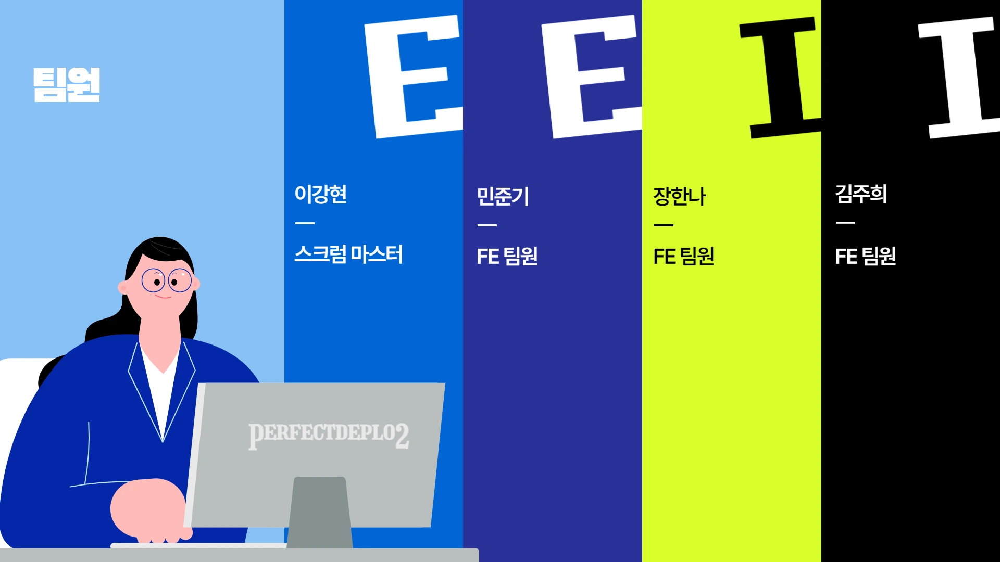
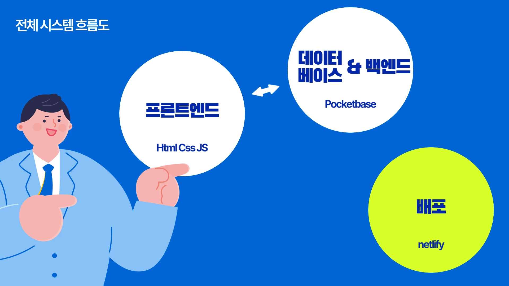
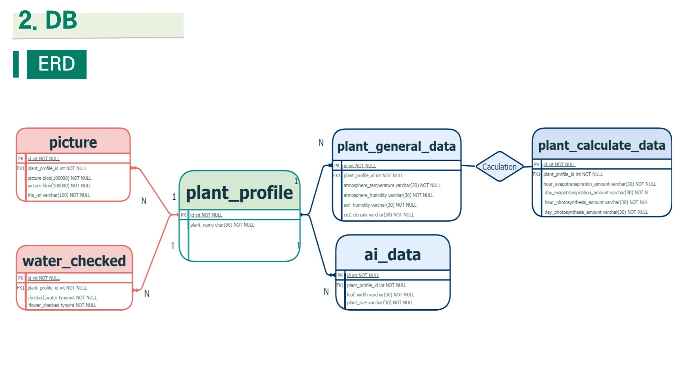
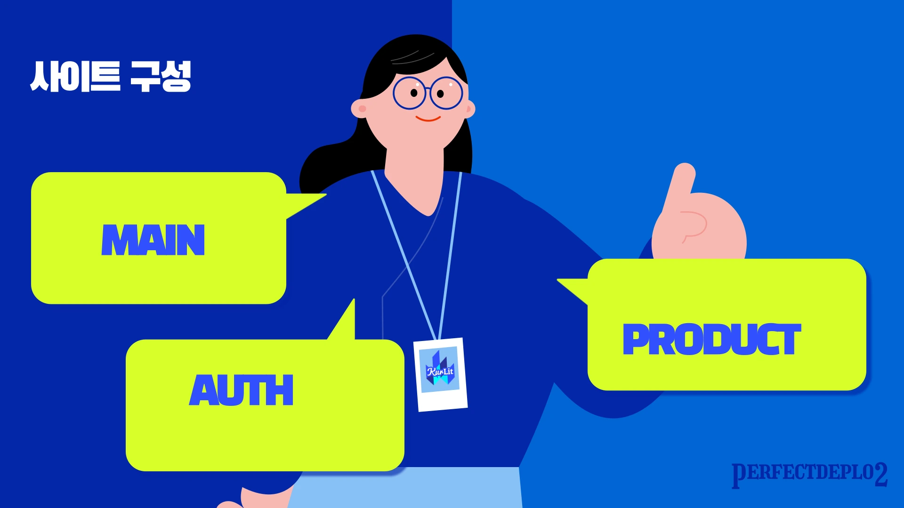
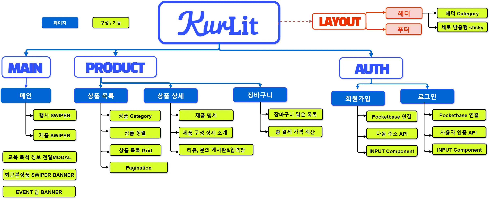
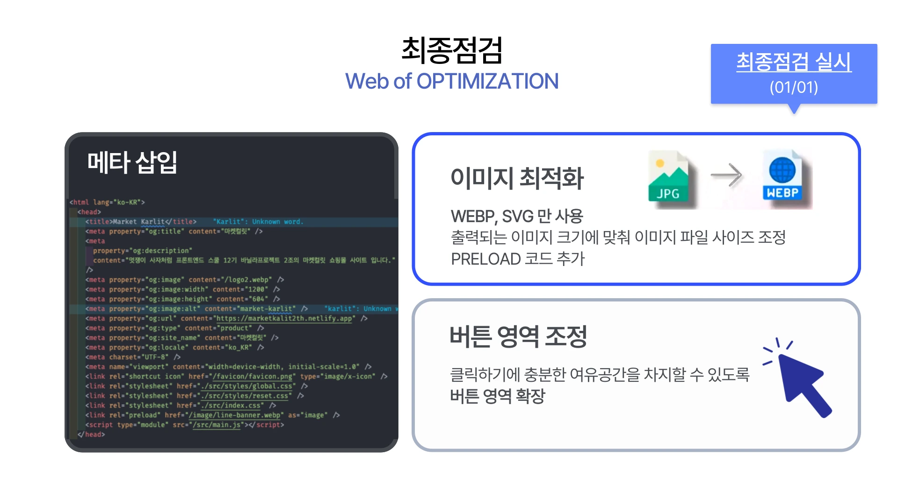
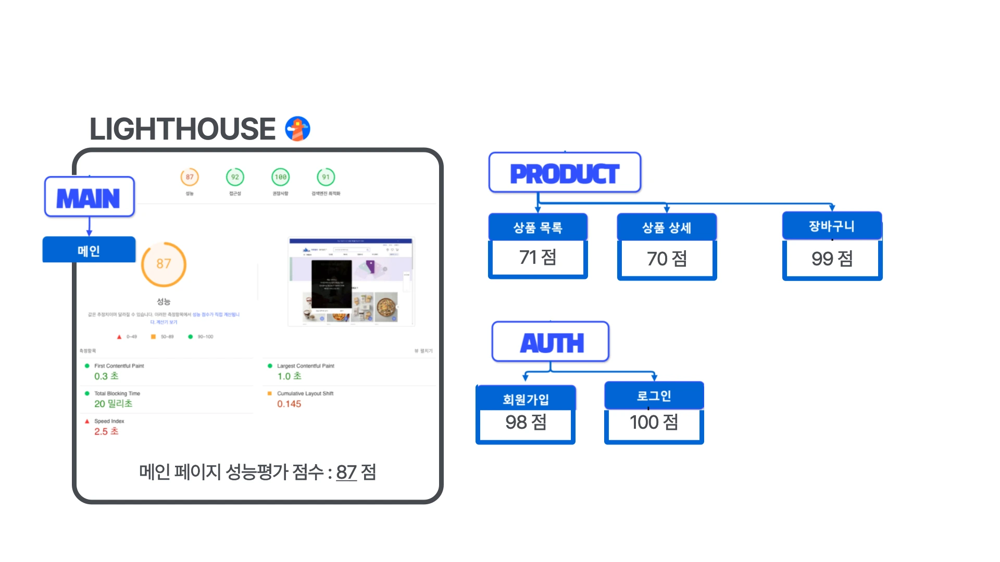

   <h1>마켓컬++릿(Lit) </h1>

<a href="https://marketkalit2th.netlify.app/">🌐 마켓컬릿 사이트</a> ｜ <a href="https://docs.google.com/presentation/d/1bfj5-75CuzfpOqHGd7qhSrTHwP1MqQ9yYQL2D_dr2nA/edit#slide=id.p">🖼️ 발표자료</a>
  

> **마켓컬리, Lit으로 재해석하다 : Lit(e)한 기술로 만든 Heavy한 퀄리티**

- **Lit과 함께 Lit 로고의 블루 컬러(primary, #283198) 컨셉**으로 트렌디한 스타일의 인기 쇼핑 사이트(🔗[마켓컬리](https://www.kurly.com/main))를 클론 코딩하였습니다.
- **멋쟁이 사자처럼 프론트엔드 부트캠프 12기 바닐라 프로젝트(2024.12.12~2025.01.03)** 참여 작품입니다.

 

> **목차**

1. [마켓컬++릿(Lit)](#)
2. [팀 소개](#team-🔥-perfect-deplo2-🔥-가-만들었습니다)
3. [시스템 구성 및 설계](#🛠️-시스템-구성-및-설계-🛠️는-이렇습니다)
   - [전체 시스템 흐름](#🔄-전체-시스템-흐름)
   - [개발 환경](#🚀-개발-환경)
   - [ERD](#🏷️-erd)
4. [결과물](#🖥️-결과물-🖥️-살펴보기)

   - [사이트구성/사이트맵](#🗺️-사이트맵)
   - [시연](#🕹️-시연)
   - [주요 기능](#🎯-주요-기능)
   - [성능 최적화 및 부하 테스트 완료](#🕵️‍♂️-성능-최적화-및-부하-테스트-완료)

 
 
 
 
 

## TEAM 🔥 Perfect Deplo2 🔥 가 만들었습니다

### 👩‍💻 팀 & 멤버

> **Perfect Deplo2** : Perfect Deployment by team 2

 

<table width="100%">
    <tr>
        <td align="center">
            
        </td>
        <td>
            <a href="https://github.com/llhyeon">이강현</a> | 스크럼 마스터    </code>  <code>Project Env</code> <code>Footer</code> <code>MainModal</code> <code>MainProductSwiper</code> <code>InputComponent</code> <code>RegisterPage</code>
            <code>CartPage</code>   <code>PocketBase DB</code>
        </td>
    </tr>
    <tr>
        <td align="center">
            
        </td>
        <td >
            <a href="https://github.com/wnsrl7250">민준기</a> | FE 팀원    </code>  <code>MainBanner</code> <code>RecentProduct</code> <code>LoginPage</code> <code>ProductFilter</code> <code>LoginPage</code> <code>Authentication 구현</code>
        </td>
    </tr>
    <tr>
        <td align="center">
            
        </td>
        <td >
            <a href="https://github.com/Hanna-Jeanne">장한나</a> | FE 팀원    </code>  <code>ButtonComponent</code> <code>ProductCard</code> <code>AddCart</code> <code>CartPage</code> <code>ProductDetailPage</code>
        </td>
    </tr>
    <tr>
        <td align="center">
            
        </td>
        <td >
            <a href="https://github.com/31blue">김주희</a> | FE 팀원    </code>  <code>Header & HeaderCategory</code> <code>Review&Inquiry</code> <code>ProductListPage</code> <code>PageUpButton</code> <code>TopBanner</code>
        </td>
    </tr>
</table>

### 🤝 협업 방식

- 프로젝트에 들어가기에 앞서 🔗[코드 컨벤션 규칙](https://github.com/FRONTENDBOOTCAMP-12th/MarketKarly-2th/wiki/Convention) 및 🔗[네이밍 전략](https://github.com/FRONTENDBOOTCAMP-12th/MarketKarly-2th/wiki/%EB%84%A4%EC%9D%B4%EB%B0%8D-%EC%A0%84%EB%9E%B5), 스타일링 방식(컴포넌트 css) 등을 세워두어 통일성을 높였습니다.
- 🔗[GitHub Projects](https://github.com/orgs/FRONTENDBOOTCAMP-12th/projects/5)와 🔗[Issues](https://github.com/FRONTENDBOOTCAMP-12th/MarketKarly-2th/issues)를 사용하여 진행도와 상황을 꾸준히 공유하였습니다.
- 주간회의를 진행하여 작업 방향이나 코드 고민에 대해 나누었고, 주간회의 결과를 수행한 일일 스크럼을 🔗[Wiki](https://github.com/FRONTENDBOOTCAMP-12th/MarketKarly-2th/wiki)를 사용하여 기록하였습니다.

 
 
 
 
 

## 🛠️ 시스템 구성 및 설계 🛠️는 이렇습니다

### 🔄 전체 시스템 흐름

### 🚀 개발 환경

| 분류                    | 기술                                                                                                                                                                                                                                                                                                                 |
| ----------------------- | -------------------------------------------------------------------------------------------------------------------------------------------------------------------------------------------------------------------------------------------------------------------------------------------------------------------- |
| 프론트엔드              |    |
| 빌드 도구               |                                                                                                                                                                                                                       |
| 백엔드                  |                                                                                                                                                                                                     |
| 패키지 매니저           |                                                                                                                                                                                                                          |
| 협업 툴                 |    |
| 코드 품질 도구          |                                                                                                      |
| 디자인 & 개발 환경(IDE) |                                                                                         |
| 호스팅                  |                                                                                                                                                                                                              |

### 🏷️ ERD

 
 
 
 
 

## 🖥️ 결과물 🖥️ 살펴보기

### 📚 사이트 구성

### 🗺️ 전체 사이트맵

### 🕹️ 시연

|                                              메인                                              |                                           회원가입                                           |                                           로그인                                           |
| :--------------------------------------------------------------------------------------------: | :------------------------------------------------------------------------------------------: | :----------------------------------------------------------------------------------------: |
|  |  |  |

|                                           로그아웃                                           |                                           상품 목록                                            |                                              상품 상세                                              |                                           장바구니                                           |
| :------------------------------------------------------------------------------------------: | :--------------------------------------------------------------------------------------------: | :-------------------------------------------------------------------------------------------------: | :------------------------------------------------------------------------------------------: |
|  |  |  |  |

### 🎯 주요 기능

메인 페이지

[헤더]
- 세로 스크롤 시 Sticky 한 줄 스타일로 모양 변형
- 카테고리 항목 연결 : 키보드(들어갈 땐 Enter)로 접근 가능
- 로그인 시 로그인 항목이 유저 이름으로 바뀜

[메인 배너]

- Swiper 라이브러리를 사용하여 배너 슬라이드를 구현
- 이전 슬라이드와 다음 슬라이드로 이동하는 버튼을 구현 / 일정시간마다 다음 슬라이드로 이동

[최근 본 상품 컴포넌트]

- Swiper 라이브러리를 사용하여 최근 본 상품 슬라이드 구현
- position: fixed;를 사용하여 컴포넌트를 고정 위치에 배치
- 로컬 스토리지에서 'viewedItem'이라는 키로 저장된 데이터를 가져옴
- JSON.parse를 통해 JavaScript 객체로 변환, 변환된 데이터를 컴포넌트의 data 속성에 저장
- 각 슬라이드는 상품의 이미지와 링크를 포함하여 사용자가 클릭할 경우 해당 상품의 상세 페이지로 이동

  

상품 목록 페이지지

[상품 Filter] : 원하는 상품을 찾기 쉽도록 상품 필터링링

- ProductFilter에서 사용자가 필터를 선택하면 선택된 필터 값이 selectedFilters로 전달
- filterProducts 메서드에서 선택된 필터를 사용하여 this.originalProducts에서 필터링된 결과를 this.products에 저장
- RecentProduct 컴포넌트를 페이지 오른쪽에 렌더링
- InputCheckbox 컴포넌트를 사용하여 사용자가 제품을 필터링할 수 있도록 구현
- 필터 목록들을 객체에 정의, 각 필터 타입별로 배열로 저장
- 객체에서 해당 필터 타입에 해당하는 배열을 가져와서 각 항목을 반복하여 렌더링
- 각 필터타입마다 표시상태를 관리, 사용자가 필터 버튼을 클릭하면 해당 필터의 상태가 토글되어 필터 항목들이 나오도록 구현
- 사용자가 선택한 필터 옵션을 저장하는 객체를 선언. 각 필터 타입별로 선택된 값을 배열 형태로 관리
- 사용자가 선택한 필터를 초기화할 수 있는 기능을 제공
- 사용자가 필터를 선택하면 handleCheckboxChange 메서드를 호출 -> 선택된 필터 값을 selectedFilters 객체에 업데이트하고, 필터 변경 사항을 상위 컴포넌트인 상품리스트 페이지에 전달

[상품 정렬]

- 원하는 기준 선택 시 상품들 재정렬

[페이지 네이션]

- 처음, 이전, 다음, 끝 버튼과 페이지 숫자가 쓰여있는 버튼 클릭 시 해당 페이지로 넘어가는 기능능

  

상품 상세 페이지

[상단 : 상품 명세 및 장바구니]

- 카드 컴포넌트에서 상품의 id를 주소창으로 넘겨 받아서 화면 상단에 받아온 상품 정보를 렌더링
- 찜하기 토글 버튼 : 시연에서 설명 (aria-pressed)
- 로컬스토리지에 사용자 정보가 존재하는지에 따라 로그인 상태 판단
- 로그인 상태에 따라 적립 텍스트 변경 / favorite 버튼을 눌렀을 때 로그인이 되어있지 않으면 로그인 유도하는 모달창 sweetAlert2로 구현

[탭 메뉴]

- sticky를 사용하여 헤더 및 상단에 고정. 각각 tablist, tab, tabpanel로 role과 id로 지정 및 aria-controls와 aria-labelledby로 tab과 tabpanel을 연결. 탭메뉴를 누르면 aria-selcted 속성 true. 화면이 스크롤 돼서 각 tabpanel에 헤더와 탭메뉴의 높이값을 더한 상단 offset 값이 같아지면 tabpanel과 연결된 tab이 활성화 (aria-selcted 속성 true로 변함)

[리뷰&후기 게시판과 등록 모달창]

- 모달창 내용 설명, 제목과 내용을 기록해야만 등록 버튼 활성화
- 5,000자 글자수 제한, 현재 몇 자 입력했는지를 실시간으로 프린트
- 플레이스홀더와 같은 효과를 주는 박스를 textarea 위에 덮어씌움

  

회원가입 페이지

- Input(text, radio, checkbox) 컴포넌트를 사용하여 구성 -> checkbox와 radio는 group 컴포넌트를 같이 사용하여 Custom Event를 통해 데이터 전달
- Custom Event 를 통해 받은 값을 {name: value} 의 객체 형태로 데이터 저장 후 validation 함수를 통해 에러메세지 렌더링
- 카카오 주소 API를 사용하여 주소 검색 기능 추가
- 각 항목 validation 검사를 통과하면 버튼을 다시 누를 수 없도록 비활성화
- ‘비밀번호' 항목과 ‘이메일' 항목이 올바른 값으로 기입이 돼야 회원가입 버튼 활성화
- 회원가입 제출 버튼을 눌렀을 경우 alert창과 함께 ‘로그인' 페이지로 리디렉션
.  

로그인 페이지

- InputText 컴포넌트로 사용자가 이메일과 비밀번호를 입력할 수 있는 필드 구성
- Button 컴포넌트를 사용
- 사용자 입력에 대한 이벤트를 처리하기 위해 handleInputChange 메서드를 정의하여, 각 입력 필드의 값 변경 이벤트를 관리
- PocketBase를 사용 유저가 로그인할 때 이메일과 비밀번호를 PocketBase에 전달하여 인증
- 인증이 성공하면 유저의 정보(record)와 인증 토큰(token)을 로컬 스토리지에 저장
- 로그인 과정 중에 오류가 발생하면 SweetAlert2 라이브러리를 사용하여 사용자에게 오류 메시지를 표시

.  

 

### 🕵️‍♂️ 성능 최적화 완료

