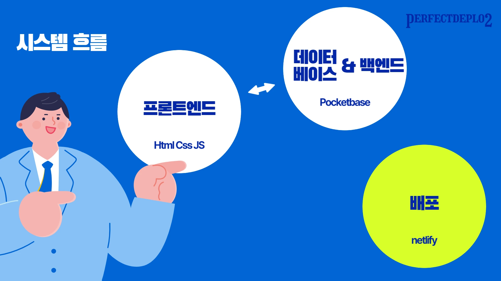

   <h1>마켓컬++릿(Lit) </h1>

<a href="https://marketkalit2th.netlify.app/">🌐 사이트 보기</a> | <a href="https://github.com/FRONTENDBOOTCAMP-12th/MarketKarly-2th/wiki">🔗 wiki</a>
  

> **마켓컬리, Lit으로 재해석하다 : Lit(e)한 기술로 만든 Heavy한 퀄리티**

- **Lit 로고의 블루 컬러 컨셉**으로 트렌디한 스타일의 인기 쇼핑 사이트(Market-Kurly)를 클론 코딩하였습니다.
- **멋쟁이 사자처럼 프론트엔드 부트캠프 12기 바닐라 프로젝트(2024.12.12~2025.01.03)** 참여 작품입니다.

  

## TEAM 🔥 Perfect Deplo2 🔥 가 만들었습니다

### Perfect Deplo2 : Perfect Deployment by team 2

 

<table align="center">
    <tr>
        <td align="center">
            
        </td>
        <td align="center">
            <a href="https://github.com/cow-coding">이강현</a> | 스크럼 마스터    </code>  <code>PocketBase</code> <code>Sign-up</code> <code>Footer </code>
        </td>
    </tr>
    <tr>
        <td align="center">
            
        </td>
        <td align="center">
            <a href="https://github.com/sunbi-s">민준기</a> | 스크럼 마스터    </code>  <code>데이터ETL</code> <code>배치학습</code> <code>Footer </code>
        </td>
    </tr>
    <tr>
        <td align="center">
            
        </td>
        <td align="center">
            <a href="https://github.com/hawe66">장한나</a> | 스크럼 마스터    </code>  <code>데이터ETL</code> <code>배치학습</code> <code>Footer </code>
        </td>
    </tr>
    <tr>
        <td align="center">
            
        </td>
        <td align="center">
            <a href="https://sweetdev.tistory.com">김주희희</a> | 스크럼 마스터    </code>  <code>Header</code> <code>Review&Inquiry</code> <code>ProductListPage </code>
        </td>
    </tr>

</table>
     
     

## 🛠️ 시스템 구성 및 설계 🛠️는 이렇습니다

### 🔄 전체 시스템 흐름

### 🚀 개발 환경

| 분류                    | 기술                                                                                                                                                                                                                                                                                                                 |
| ----------------------- | -------------------------------------------------------------------------------------------------------------------------------------------------------------------------------------------------------------------------------------------------------------------------------------------------------------------- |
| 프론트엔드              |    |
| 빌드 도구               |                                                                                                                                                                                                                       |
| 백엔드                  |                                                                                                                                                                                                     |
| 패키지 매니저           |                                                                                                                                                                                                                          |
| 협업 툴                 |    |
| 코드 품질 도구          |                                                                                                      |
| 디자인 & 개발 환경(IDE) |                                                                                         |
| 호스팅                  |                                                                                                                                                                                                              |

### 🏷️ ERD

## 🖥️ 주요 기능 🖥️ 살펴보기

### 🗺️ 사이트맵

### 🕹️ 시연

### 💡 성능 최적화 및 부하 테스트 완료

- 경기 일정 및 결과 데이터에 대한 데이터베이스 쿼리 최적화 
- nGrinder를 이용한 성능 테스트 및 최적화 수행 
- Redis와 JPA를 사용하여 대용량 트래픽에 대한 정합성 및 동시성 처리
